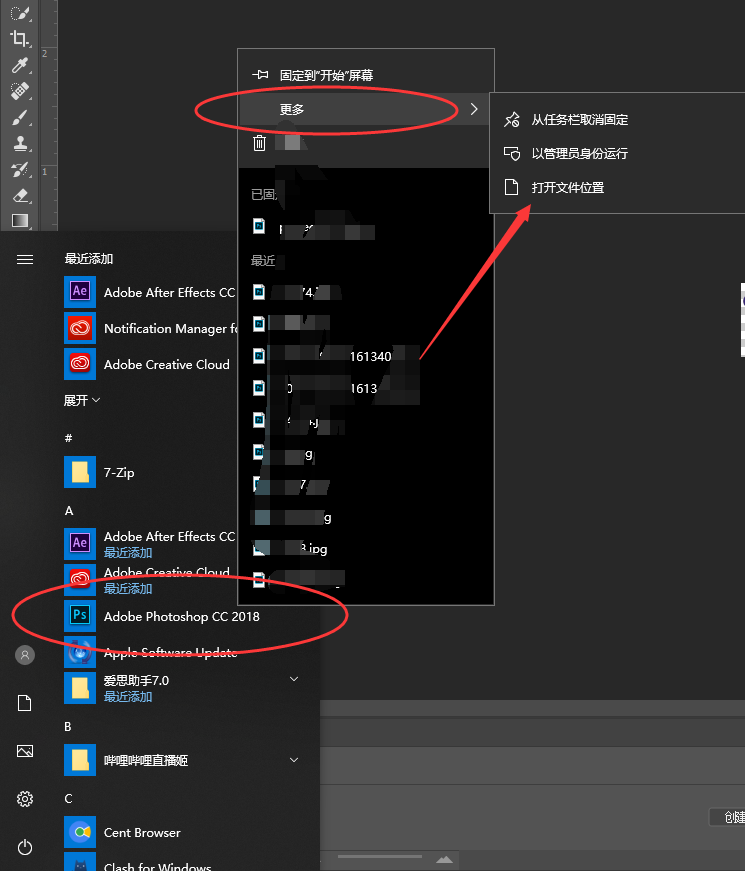

# 先整理一下思路
由于 Adobe CC 系列版本到 2018 版本之前（包括Adobe CC 2018）的激活信息都和一个 dll 相关，所以只要保证那个包含激活信息的 dll 文件有效即可。无论你是什么版本，只要替换掉那个 dll 文件，就可以激活成功。

# 安装一个完整的程序
首先，我们要安装一个完整的程序，以 Adobe Photoshop CC 2018 为例。下载安装 Adobe 官方提供的试用安装程序即可。[点击下载 Photoshop CC 2018 安装程序](http://prdl-download.adobe.com/Photoshop/66A1D1E00DE44601B041A631261EC584/1507846032938/AdobePhotoshop19-mul_x64.zip)

> - 断网可以不用登录 Adobe 账号；
>
> - 默认安装在 C 盘不建议修改，一是修改太麻烦，二是如果 C 盘是固态硬盘可以让 PS 响应更快！

# 破解激活的方法
下载注册机，使用管理员身份运行。如果电脑有杀毒软件，请将注册机添加信任、加入白名单或设置不拦截。

> 如果你有迈克菲 McAfee **请直接将全部含有 McAfee 的程序卸载并重启！**）

1. 正常打开后，选择需要激活的 Adobe 应用，其他的不做更改。我是需要激活 Adobe Photoshop CC 2018（**cc2018的程序用2017的补丁即可**），选择好后点击点击 ==**Install**==；

2. 依次打开文件夹：`C:\Program Files\Adobe\Adobe Photoshop CC 2018\`；

3. 最后再选择==**amtlib.dll**==点击打开就激活成功了！

# 附
**amtlib.dll 所在的位置就是我们程序安装的位置，或者叫安装目录。**

默认的安装位置一般为：

- 64位系统  `C:\Program Files\Adobe\Adobe Photoshop CC 2018\`

- 32位系统  `C:\Program Files (x86)\Adobe\Adobe Photoshop CC 2018\`

如果你更改了安装位置，请参考一下方法查找程序的安装路径：

1. 在==开始菜单==找到对应的图标，比如我的 Photoshop 打开文件位置；

2. 找到对应的快捷方式后右键==打开文件所在位置==。 此时的路径就是我们程序的安装路径了。

> 教程整理自互联网，不提供注册机下载，如有侵权请联系删除！
>
> 邮箱：support@gxzyzd.com

